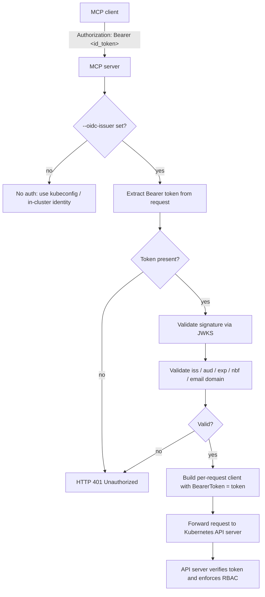
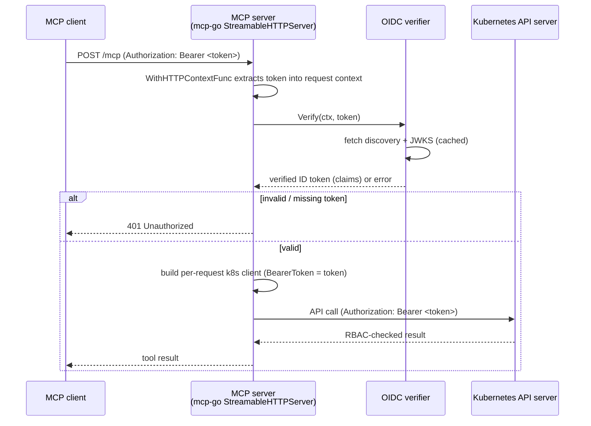
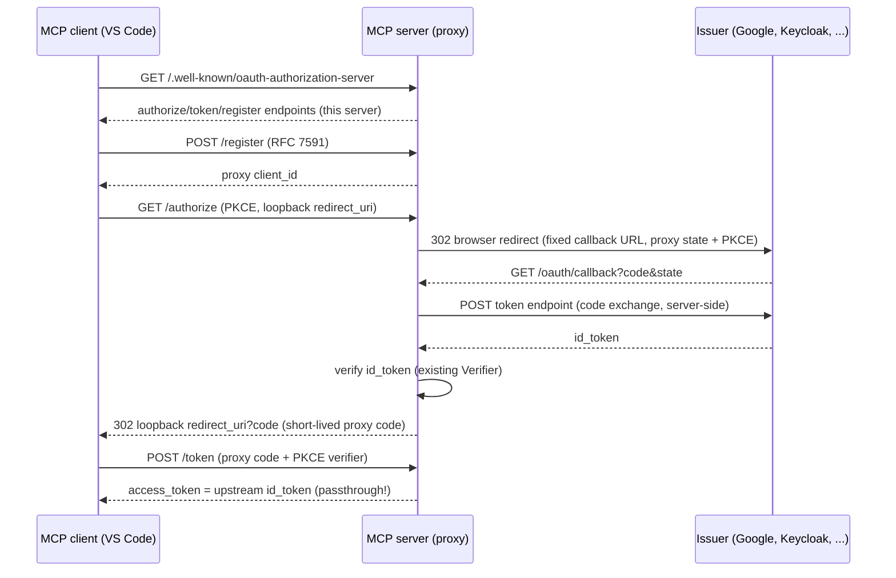

# MCP server OIDC authentication with passthrough

The Kubernetes MCP server supports OIDC authentication with **passthrough**: the user's OIDC access token is forwarded verbatim to the Kubernetes API server, which verifies it against its own OIDC authenticator configuration.

This pattern delegates the authentication **and** authorization decisions to the API server. A user can therefore only ever exercise the permissions granted by their Kubernetes RBAC roles, and the MCP server itself can never escalate privileges or mint impersonation credentials on the user's behalf.

---

## 1. Goals

- Authenticate MCP HTTP clients using standard OIDC access tokens.
- Validate the token locally (signature, issuer, audience, expiry, email domain) *before* forwarding it.
- Forward the **validated** token to the Kubernetes API server so it authenticates the user and enforces RBAC.
- Support the existing multi-cluster and in-cluster modes without changing the tool catalog or client-facing behavior.
- Remain disabled by default: OIDC is only active when `--oidc-issuer` is set.

## 2. Non-goals

- In **passthrough mode** (default), the MCP server does **not** issue, refresh, or exchange tokens. Client credential acquisition happens in the MCP client against the issuer directly.
- In **proxy mode** (`--oidc-callback-url` set), the server terminates the authorization-code flow but still does **not** mint its own tokens: it hands the upstream provider's token to the client verbatim (see §6.0.1).
- The MCP server does **not** map OIDC identities to Kubernetes users/groups itself. That mapping belongs to the API server's `--oidc-*` authenticator flags and RBAC bindings.
- In-cluster service-account authentication is not affected when OIDC is disabled.

## 3. Security model



Key properties:

- **Least privilege**: the MCP server holds no long-lived user credentials. Every request carries the caller's own short-lived token.
- **No privilege escalation**: the MCP server never generates an `Impersonate-User` header from OIDC claims unless the operator explicitly set `--as`, and even then the impersonation is performed *through* the API server, which applies its own impersonation authorization rules.
- **Defense in depth**: local validation (signature + claims) rejects obviously bad tokens cheaply before they ever reach the API server. The API server remains the authoritative verifier.

---

## 4. Configuration

### 4.1 CLI flags

The flags follow the existing convention in [`cmd/mimiops-mcp/flags.go`](../../cmd/mimiops-mcp/flags.go), where every flag has a corresponding environment variable and a `defaultXxx` constant.

| Flag                    | Env var             | Type   | Description                                                                                     |
| ----------------------- | ------------------- | ------ | ----------------------------------------------------------------------------------------------- |
| `--oidc-issuer`         | `OIDC_ISSUER`       | string | OIDC issuer URL (e.g. `https://accounts.google.com`). Enables OIDC when non-empty.              |
| `--oidc-client-id`      | `OIDC_CLIENT_ID`    | string | Client ID that must be present in the token's `aud` claim (e.g. `mcp-server`).                  |
| `--oidc-email-domains`  | `OIDC_EMAIL_DOMAINS`| string | Comma-separated list of allowed email domains (e.g. `example.com,example.org`). Empty = allow all. |
| `--oidc-callback-url`   | `OIDC_CALLBACK_URL` | string | Fixed OAuth callback URL registered with the issuer (e.g. `https://mcp.example.com/oauth/callback`). Enables proxy mode when set. |
| `--oidc-client-secret`  | `OIDC_CLIENT_SECRET`| string | Issuer client secret for the code exchange in proxy mode. Optional (public clients use PKCE).   |
| `--oidc-scope`          | `OIDC_SCOPE`        | string | Space-separated OAuth scopes requested from the issuer; must include `openid` (default: `openid profile email`). |

The `Flags` struct in `flags.go` gains three new fields (`OIDCIssuer`, `OIDCClientID`, `OIDCEmailDomains`), each populated in `DefaultFlags()` via `withDefaultEnv(...)` and registered in `AddPersistentFlags(...)` with `pflag`. `Flags.Config()` forwards them into `internal/config.Config`.

### 4.2 Config plumbing

[`internal/config/config.go`](../../internal/config/config.go) is extended with:

```go
OIDCIssuer       string
OIDCClientID     string
OIDCEmailDomains []string // parsed from the comma-separated flag/env value
```

Parsing/validation of the email-domain list (trimming, lowercasing, dropping empty entries) happens in `Config()` so an invalid value fails fast at startup rather than on the first request.

### 4.3 Validation rules at startup

When `--oidc-issuer` is non-empty:

- `--oidc-issuer` must be a valid `https://` URL (insecure `http://` is rejected by default, matching OIDC discovery expectations).
- `--oidc-client-id` is recommended but not strictly required unless the provider's tokens carry an `aud` claim (see §6.2). If the provider's discovery document advertises that `aud` is always present, an empty client ID is a startup error.
- `--oidc-email-domains` is optional; when set it must parse to at least one non-empty domain.

These checks are performed in `newServerCmd`/`serveSSE` (alongside the existing `newLogger` validation) so configuration errors surface before the transport blocks.

---

## 5. Request flow



---

## 6. Implementation details

The implementation touches the following files. No changes are needed to individual tools; the token is threaded through the existing cluster-resolution path.

### 6.0 Client authorization discovery (VS Code, Claude, ...)

MCP clients do not prompt for tokens manually: they expect the server to advertise *how* to obtain one, per the [MCP authorization spec](https://modelcontextprotocol.io/specification/2025-06-18/basic/authorization) and RFC 9728. When OIDC is enabled the server therefore:

- serves OAuth 2.0 Protected Resource Metadata at `/.well-known/oauth-protected-resource`, plus the variants clients probe for an endpoint like `https://host/mcp`: the RFC 9728 path-inserted `/.well-known/oauth-protected-resource/mcp` and the endpoint-appended `/mcp/.well-known/oauth-protected-resource`. These endpoints are unauthenticated and CORS-enabled by design.
- includes a `WWW-Authenticate: Bearer resource_metadata="..."` header on every 401 response so clients find the metadata without guessing.

In passthrough mode (the default) the MCP server does **not** implement the authorization-code flow itself (§2): the client fetches the issuer's own discovery documents (`/.well-known/oauth-authorization-server` or `/.well-known/openid-configuration`), opens the `authorization_endpoint` in a browser, exchanges the code at the `token_endpoint`, and then presents the resulting token as the Bearer credential. The issuer must therefore be a full OAuth 2.0 authorization server (Keycloak, Dex, Entra, ...) with dynamic client registration. Providers without dynamic client registration (Google) or that require fixed redirect URIs need **proxy mode** (§6.0.1).

The resource identifier is derived from the request (`X-Forwarded-Proto`/`X-Forwarded-Host` honored) so the advertised URL matches how the client reached the server behind TLS-terminating proxies.

#### 6.0.1 OAuth proxy mode (`--oidc-callback-url`)

Some providers cannot be used by MCP clients directly: Google has no dynamic client registration (RFC 7591) and requires exact pre-registered redirect URIs, which conflicts with the client's random loopback port. When `--oidc-callback-url` is set, the MCP server becomes an **OAuth 2.0 authorization-server proxy** and terminates the authorization-code flow itself at a *fixed* callback URL registered with the issuer:



Properties:

- **No token minting**: the proxy hands out the upstream provider's `id_token` verbatim, so `/mcp` verification and the Kubernetes API server see exactly the token the issuer produced. The passthrough security model is unchanged.
- **Fixed redirect URI**: the only URI registered with the issuer is `--oidc-callback-url`; the client's loopback redirect is validated against what it registered dynamically via `/register`.
- **PKCE end-to-end**: the client proves possession of its verifier at `/token`; the proxy uses its own verifier toward the issuer.
- **Configurable scopes**: `--oidc-scope` overrides the scopes requested from the issuer (default `openid profile email`); `openid` is required because the proxy hands out the `id_token`. The configured scopes are also advertised in `scopes_supported`.
- **Single-use, short-lived codes**: proxy authorization codes expire after 2 minutes and are burned on first use (even failed validation revokes them).
- **Restart-tolerant clients**: sessions and grants are in-memory (a restart aborts in-flight logins), but MCP clients with cached dynamic registrations keep working: `/authorize` auto-registers unknown client IDs with a format-validated redirect URI, which is security-equivalent to the open `/register` endpoint.

Trade-off: in proxy mode the server holds the upstream client secret (`--oidc-client-secret`) and briefly stores the upstream token while the client redeems the proxy code. This is the price of a fixed callback URL; passthrough mode remains available for providers with dynamic client registration.

#### Troubleshooting client authorization

- **`invalid_client`** can originate from three places:
  - *Google's authorize page (browser)*: the `--oidc-client-id` is not recognized by the issuer — check it against the client ID shown in Google Cloud Console (a recreated client gets a new ID).
  - *The issuer's token endpoint, called by the proxy*: a **Web application** client requires `--oidc-client-secret`; a **Desktop app** client must **not** have one (a bogus secret is rejected). The proxy surfaces the issuer's error both in the browser page and the server logs.
  - *The proxy's `/authorize`*: MCP clients cache dynamic registrations, which do not survive server restarts. The proxy therefore auto-registers unknown client IDs with a format-validated redirect URI (equivalent to the open `/register` endpoint), so this case should no longer fail.
- **`redirect_uri_mismatch`** (Google): the MCP client's loopback redirect (`http://localhost:<random port>/callback`) is not registered on the OAuth client. Either use a *Desktop app* type client (loopback redirects with any port are accepted per RFC 8252), or enable **proxy mode** (§6.0.1) with `--oidc-callback-url` so the only redirect URI the issuer ever sees is the fixed callback. This error comes from the authorization server, not from the MCP server.
- **No dynamic client registration**: some providers (notably Google) do not implement RFC 7591, which MCP clients rely on to obtain a `client_id` automatically. Use proxy mode (`--oidc-callback-url`), or prefer Keycloak, Dex, Zitadel, Auth0 or Entra as the issuer for direct browser-based login flows.
- **Audience mismatch after login**: MCP clients send the authorization server's `access_token` as the Bearer credential; some providers issue access tokens whose `aud` differs from the client ID. If local verification rejects otherwise-valid tokens with an audience error, check what `aud` the provider actually issues and align `--oidc-client-id` (or disable the check by leaving it empty).

### 6.1 `cmd/mimiops-mcp/flags.go`

- Add `flagOIDCIssuer`, `flagOIDCClientID`, `flagOIDCEmailDomains` constants and matching `envOIDCIssuer`, `envOIDCClientID`, `envOIDCEmailDomains` constants (empty-string defaults).
- Add the three fields to `Flags`, populate them in `DefaultFlags()`, register them in `AddPersistentFlags(...)`, and map them in `Config()`.

### 6.2 `internal/config/config.go`

- Add the three config fields (email domains as a `[]string`).
- Add a helper to normalize/validate the email-domain list.

### 6.3 `internal/oidc` (new package)

A new package `internal/oidc` owns all token verification logic, keeping it independent of the k8s client code and easy to unit test.

Responsibilities:

- **Discovery**: fetch `{issuer}/.well-known/openid-configuration`, cache the `jwks_uri`, supported algorithms, and the `issuer`/`authorization_endpoint` values. Cache with a TTL and refresh on `kid` miss.
- **JWKS**: fetch and cache the provider's JSON Web Key Set; support key rotation by re-fetching when a token references an unknown `kid`.
- **Token verification**: parse the JWT header and claims, select the signing key by `kid`, and verify the signature using the algorithm advertised by the discovery document (never trust the token's `alg` alone).
- **Claim validation** (see §7).
- **Verifier type**: `type Verifier struct{...}` with `New(ctx, cfg) (*Verifier, error)` (performs discovery at startup and fails fast) and `Verify(ctx, rawToken string) (*Claims, error)`.

The package is constructed once in `serveSSE` and shared by all requests.

### 6.4 `cmd/mimiops-mcp/server.go`

- When `cfg.OIDCIssuer != ""`, construct the `internal/oidc.Verifier` and register an authentication layer.
- The existing `server.WithHTTPContextFunc` (already used for logger injection) is extended to also extract and validate the `Authorization: Bearer <token>` header, then stash the verified claims and raw token in the request context. This mirrors the existing `logger.Inject`/`logger.FromContext` context-value pattern.
- An invalid or missing token produces an `HTTP 401 Unauthorized` response before any tool handler runs. The response body is a plain error message (no token, no claims) so nothing sensitive is leaked.
- `serveSSE` logs the OIDC enablement state (e.g. `"oidc", true`, `"oidcIssuer", cfg.OIDCIssuer`) alongside the existing `"allowDestructive"`, `"multiCluster"`, `"clusters"` fields.

> Note: `mcp-go` v0.58.0's `StreamableHTTPServer` exposes `WithHTTPContextFunc` (`HTTPContextFunc = func(context.Context, *http.Request) context.Context`) as the per-request hook; there is no general-purpose HTTP middleware option in this version, so context injection is the correct extension point.

### 6.5 `internal/k8s/multicluster.go`

- `GetCluster` remains the cached, identity-less path used when OIDC is disabled.
- Add a new method `GetClusterForRequest(ctx context.Context, clusterName string) (*Client, error)` that:
  1. Reads the verified token/claims from the context (put there in §6.4). If OIDC is disabled, it delegates to `GetCluster`.
  2. Resolves the target context exactly as `GetCluster` does (including the in-cluster vs multi-cluster dispatch).
  3. Builds a **fresh** per-request client with the token injected (see §6.6). Per-request clients are **not** cached, because each caller has a distinct token.

### 6.6 `internal/k8s/auth.go`

- Refactor the existing `newClientForCluster` so the token injection can be applied to the `rest.Config` produced by `configFlags.ToRESTConfig()`:
  - Set `restConfig.BearerToken = oidcToken` and clear `restConfig.BearerTokenFile` so the OIDC token takes precedence over the kubeconfig user's static token (and over the in-cluster service-account token).
  - **Strip all client-certificate credentials** — clear `restConfig.CertData`, `restConfig.CertFile`, `restConfig.KeyData`, and `restConfig.KeyFile` — so the API server is authenticated solely by the forwarded OIDC token rather than a TLS client certificate from the kubeconfig (see §12).
  - When `--as` is set, keep the existing impersonation wiring (`Impersonate`/`ImpersonateGroup` are already copied from the global `ConfigFlags`), which client-go renders as the `Impersonate-User`/`Impersonate-Group` headers.
  - Rebuild the clientset with `kubernetes.NewForConfig(restConfig)` so the transport is bound to the per-request token.
- `contextAuthInfo` already reports `Impersonate`, `ImpersonateGroups`, and `HasToken`; with OIDC, `HasToken` reflects the forwarded OIDC token and `User.Name` can carry the OIDC `sub`/`email` for observability (sanitized in logs).

### 6.7 `internal/tools/clusters/clusters.go`

- `ResolveCluster(mc, req)` is extended (or a sibling `ResolveClusterForRequest(ctx, mc, req)` is added) to pass the request context to `GetClusterForRequest`. This is the single choke point through which every tool obtains its cluster client, so no tool needs to change.

---

## 7. Token validation

The verifier validates, in order:

1. **Well-formedness** — the token is a compact JWT with three segments.
2. **Signature** — using the provider's JWKS, selected by `kid`, restricted to the algorithms advertised by the discovery document (`RS256`, `ES256`, etc.).
3. **Issuer (`iss`)** — must exactly equal the configured `--oidc-issuer`.
4. **Audience (`aud`)** — when `--oidc-client-id` is set, the `aud` claim (string or array) must contain that client ID.
5. **Expiry / not-before (`exp`, `nbf`)** — with a small clock-skew allowance.
6. **Email domain** — when `--oidc-email-domains` is set, the `email` claim must be present, `email_verified` must be `true`, and the email's domain must be in the allowed list.

Any failure returns `401 Unauthorized`. The API server performs its own verification again and remains the authority on whether the user's RBAC bindings permit the requested action.

---

## 8. Interaction with impersonation (`--as`)

- The `--as` flag (and `AS` env var) is the existing `ConfigFlags.Impersonate`, surfaced by `genericclioptions`. When OIDC is enabled **and** `--as` is set, the MCP server still forwards the OIDC token as the primary credential and additionally sets the `Impersonate-User` header (and `Impersonate-Group` for `--as-group`) on API requests.
- This is intended for operator-controlled "service" scenarios; it is *not* derived from OIDC claims, so a user cannot request their own impersonation. The API server enforces whether the authenticated identity is allowed to impersonate the requested user.
- Without `--as`, the user's OIDC identity is used directly and no impersonation headers are added.

---

## 9. Multi-cluster and in-cluster behavior

- **Multi-cluster mode** (`kubeconfig` present): the list of available clusters comes from the kubeconfig (`MultiClusterClient.ListClusters()`). The OIDC token is forwarded to whichever cluster the tool targets; every cluster must be configured with an OIDC authenticator that trusts the same issuer for the passthrough to succeed. Clusters that do not recognize the issuer will reject the token with their own 401.
- **In-cluster mode**: a single cluster is available. The pod's service-account credentials are replaced by the forwarded OIDC token when OIDC is enabled (the token takes precedence over `rest.InClusterConfig()`'s service-account token).

## 10. Discovery and JWKS caching

- Discovery metadata and the JWKS are cached in memory and shared across requests to avoid a network round-trip per call.
- On a `kid` not present in the current JWKS, the verifier re-fetches the JWKS once (handling provider key rotation) before failing.
- Cache entries honor the provider's HTTP cache headers where present, and fall back to a conservative TTL otherwise. A future enhancement may add a `--oidc-jwks-ttl` flag.

---

## 11. Error handling and logging

- Missing, malformed, expired, or disallowed tokens all map to `HTTP 401 Unauthorized` with a generic body.
- The token and any claims are never written to logs. The existing [`internal/utils` sanitizer](../../internal/utils/sanitize.go) already masks `Bearer`/JWT values (`authorization` key and the `eyJ...` JWT pattern), providing a second layer of protection if a token accidentally reaches a log line.
- Verification failures are logged at debug level with the reason (e.g. `issuer mismatch`, `aud not allowed`, `email domain denied`) but without the token material.

## 12. Limitations and open questions

- **Client-certificate kubeconfig auth**: when OIDC is enabled, any TLS client certificate configured in the kubeconfig is **removed** from the per-request `rest.Config` (`CertData`/`CertFile`/`KeyData`/`KeyFile` are cleared). This guarantees the API server authenticates the caller by the forwarded OIDC token rather than a client-certificate identity, which would otherwise bypass OIDC passthrough entirely.
- **`aud` behavior varies by provider**: some providers omit `aud` or use the resource server differently. The client-ID validation is therefore only enforced when `--oidc-client-id` is set.
- **Token refresh**: the MCP server does not refresh tokens; clients must present a fresh token on each request (or reconnect the SSE stream once their token expires).
- **Single issuer**: the configuration supports exactly one issuer, shared by all clusters.

## 13. Dependencies

The feature requires an OIDC/JWT library. The project currently has no direct OIDC dependency (`golang.org/x/oauth2` is present only indirectly). Options to evaluate:

- `github.com/coreos/go-oidc/v3` — standard, well-maintained, handles discovery + JWKS + claim verification (`VerifyIDToken`).
- A hand-rolled verifier using `golang.org/x/oauth2` + a JWT library — more control, more code to maintain.

Prefer `coreos/go-oidc/v3` for correctness and reduced maintenance burden.
